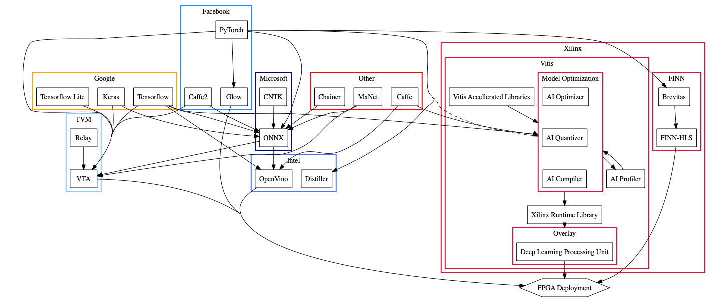

# Masters Thesis

## Neural Network Compression

Current State of Neural Network Compression and Deployment

## Tools

### Model Description Libraries

| Library                                                     | Maintainer                                                         | Desc                                                                                                                                                                                                                                                                                                   | Status             |
| ----------------------------------------------------------- | ------------------------------------------------------------------ | ------------------------------------------------------------------------------------------------------------------------------------------------------------------------------------------------------------------------------------------------------------------------------------------------------ | ------------------ |
| [PyTorch](https://pytorch.org/)                             | Facebook                                                           | Facebook backed and Open Source. Dynamic Computational graph                                                                                                                                                                                                                                           | Actively Developed |
| [Tensorflow](https://www.tensorflow.org/)                   | Google                                                             | Google Backed. Tensorflow Lite for Mobile Deployment. Python and C++. Static graph                                                                                                                                                                                                                     | Actively Developed |
| [Keras](https://keras.io/)                                  | François Chollet/Google                                            | Google Employee François Cholle developed. Great for quick prototyping. Wrapper for Tensorflow, Theano, CNTK. It is tightly integrated with tensorflow 2                                                                                                                                               | Active             |
| [CNTK](https://docs.microsoft.com/en-gb/cognitive-toolkit/) | Microsoft                                                          | toolkit that describes neural networks as a series of computational steps via a directed graph                                                                                                                                                                                                         | Depreciated        |
| [ONNX](https://onnx.ai/)                                    | Joint Venture between Facebook and Microsoft.                      | Wide spread enterprise use. Multiple libraries convert to universal Model. Interchangable AI Models                                                                                                                                                                                                    | Actively Developed |
| [MxNet](https://mxnet.apache.org/)                          | Apache                                                             | Has wide Industry support and a large community of users. Focus on scalability over multiple GPUs and portability with large number of languages supported and most major OS supported. Has libraries expanding on core functionality for NLP and CV [Repo](https://github.com/apache/incubator-mxnet) | Actively Developed |
| [Chainer](https://chainer.org/)                             | Community, Preferred Networks, Inc.                                | open source deep learning framework written purely in Python on top of Numpy and CuPy. First to use "define-by-run"(dynamic computational graph) and focuses on object oriented design for defining neural networks.                                                                                   | Actively Developed |
| [Caffe](https://caffe.berkeleyvision.org/)                  | UC Berkley                                                         | expression, Focus on speed, and modularity. Last stable release over 2 years ago. However, it is still supported by many pruning and deployment libraries so still used in industry.                                                                                                                   | Depreciated        |
| [Caffe2](https://caffe2.ai/)                                | Facebook - Merged with PyTorch as of 2018                          | Focus on light-weight and modular. Caffe2go for mobile deployment.                                                                                                                                                                                                                                     | Depreciated        |
| [Theano](http://deeplearning.net/software/theano/)          | Montreal Institute for Learning Algorithms, University of Montreal | Focus on ability to define, optimize, and evaluate mathematical expressions involving multi-dimensional arrays efficiently. Last Release 2017 only just being phased out in major libraries backends.                                                                                                  | Depreciated        |

### Compression Libraries and extensions

| Tool                                                                                                                                                    | Maintainer                         | Desc                                                                                                                                                                                                                                                                                                                                                                             |
| ------------------------------------------------------------------------------------------------------------------------------------------------------- | ---------------------------------- | -------------------------------------------------------------------------------------------------------------------------------------------------------------------------------------------------------------------------------------------------------------------------------------------------------------------------------------------------------------------------------- |
| [Brevitas](https://github.com/Xilinx/brevitas)                                                                                                          | Xilinx Research                    | Xilinx Research team Neural Network Quantization Framework from Xilinx Research FINN project originally built on theano, now being migrated to PyTorch.                                                                                                                                                                                                                          |
| [Vitis](https://www.xilinx.com/products/design-tools/vitis/vitis-platform.html)                                                                         | Xilinx                             | Xilinx commercial software Suite with ["Vitis AI"](https://www.xilinx.com/products/design-tools/vitis/vitis-ai.html) Library supporting caffe and tensorflow and potentially pytorch. including AI Optimizer module for pruning, AI Quantizer for Quantizing, and AI Compiler for optimising code for DPU (Deep Learning Processing Unit) a layer on top of the bare metal FPGA. |
| [Intel Distiller](https://github.com/NervanaSystems/distiller)                                                                                          | Intel                              | Compression Library ontop of PyTorch. State of the art algorithms. Includes Pruning, Quantisation, Regularization, Knowledge Distilation, Conditional Computation                                                                                                                                                                                                                |
| [Keras-Surgeon](https://github.com/BenWhetton/keras-surgeon)                                                                                            | Ben Whetton                        | Developed by Ben Whetton. Pruining for keras models. Last updated a year ago                                                                                                                                                                                                                                                                                                     |
| [QNNPACK](https://github.com/pytorch/QNNPACK)                                                                                                           | Facebook                           | A mobile-optimized library for low-precision high-performance neural network inference. Focus on Quantization. Intended Not for research but for high level frameworks                                                                                                                                                                                                           |
| [MXNet Contrib Quantization](https://cwiki.apache.org/confluence/display/MXNET/MXNet+Graph+Optimization+and+Quantization+based+on+subgraph+and+MKL-DNN) | Apache/Community                   | MxNet Contrib library for Quantization.                                                                                                                                                                                                                                                                                                                                          |
| [tensorflow_model_optimization](https://www.tensorflow.org/model_optimization)                                                                          | Google                             | Includes Model optimization techniques using Quantization and Pruning APIs                                                                                                                                                                                                                                                                                                       |
| [Chainer Pruner](https://github.com/DeNA/ChainerPruner)                                                                                                 | [tkat0](https://github.com/tkat0/) | Channel Pruning form chainer                                                                                                                                                                                                                                                                                                                                                     |
| [Tensorflow Lite](https://www.tensorflow.org/lite)                                                                                                      | Google                             | More geared towards Mobile deployment. Model Optimization through Quantization. Two in components: TF Lite interpreter and TF Lite Converter which converts tensorflow models to tflite optimized models.                                                                                                                                                                        |
| [Optuna](https://github.com/optuna/optuna)                                                                                                              | Optuna                             | Automatic hyperparameter optimization software framework.                                                                                                                                                                                                                                                                                                                        |

### Deployment Tools

| Tool                                                                            | Maintainer      | Desc                                                                                                                                                                                                                                                                                                                                                           |
| ------------------------------------------------------------------------------- | --------------- | -------------------------------------------------------------------------------------------------------------------------------------------------------------------------------------------------------------------------------------------------------------------------------------------------------------------------------------------------------------- |
| [TVM Neural Network Compiler Stack](https://tvm.ai/)                            | Apache          | [Relay](https://docs.tvm.ai/dev/relay_intro.html) is a Intermediate Representation Library for building dataflow computational graphs. [VTA](https://tvm.ai/vta) A programmable accelerator and an end-to-end solution that includes drivers, a JIT runtime, and an optimizing compiler stack based on TVM. Includes deployment and simulation tools for FPGAs |
| [Glow](https://github.com/pytorch/glow)                                         | Facebook        | Pytorch Compiler                                                                                                                                                                                                                                                                                                                                               |
| [OpenVino](https://software.intel.com/en-us/openvino-toolkit)                   | Intel           | Deployment and model optimization for FPGA                                                                                                                                                                                                                                                                                                                     |
| [FINN-HLS](https://github.com/Xilinx/finn-hlslib)                               | Xilinx Research | Vivaldo For FINN                                                                                                                                                                                                                                                                                                                                               |
| [Vitis](https://www.xilinx.com/products/design-tools/vitis/vitis-platform.html) | Xilinx          | Commercial Software stack including Vivaldo for simulation and deployment                                                                                                                                                                                                                                                                                      |

## References

### Papers Im Reading

[Link](papers/README.md)

### Papers on pruning

List of papers on pruning: [Link](https://github.com/he-y/Awesome-Pruning)
Other Collection of compression techniques [link](https://github.com/cedrickchee/awesome-ml-model-compression)